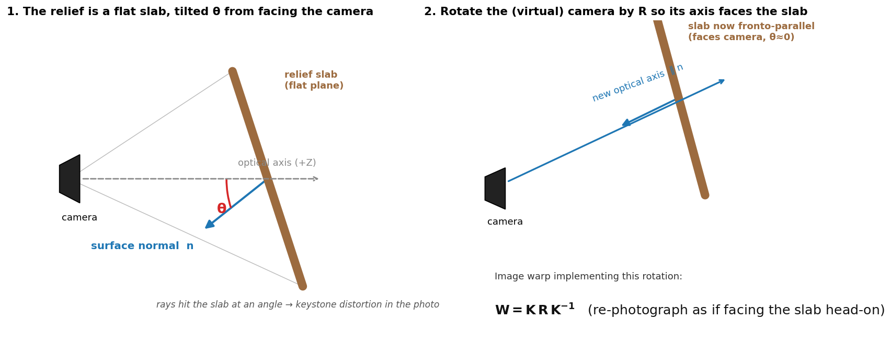
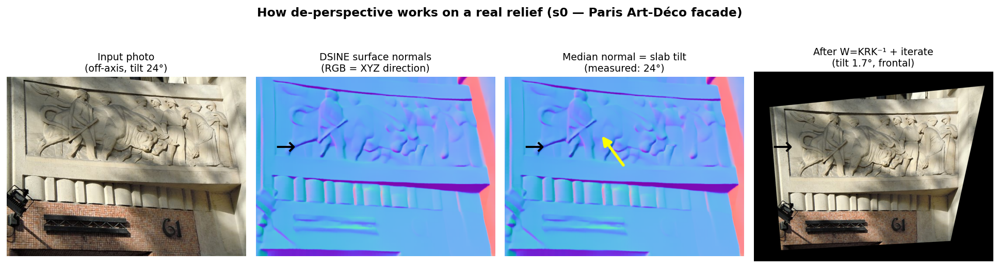
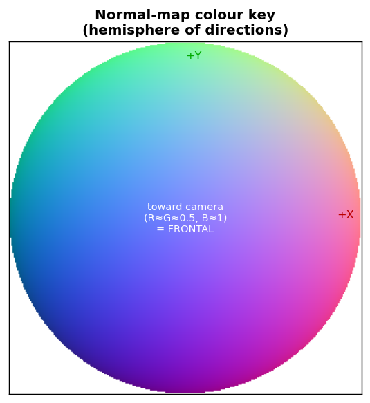
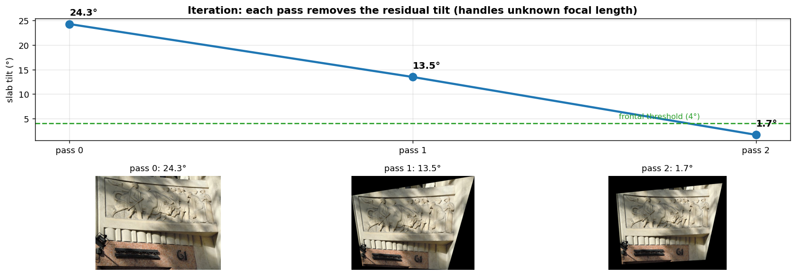

# How the de-perspective (spatial rectifier) works

Goal: take an off-axis photo of a relief on a wall and warp it so the relief faces
the camera head-on — without needing any straight lines, frame, or rectangle in the
image. It works on pure figurative carving, which line-based methods (Lightroom
"Upright", darktable `ashift`, vanishing points) cannot do.

## The one idea

A relief is a **flat slab** stuck on a wall. When you photograph it off-axis, the
slab is simply **tilted** relative to the camera — that tilt is the entire distortion.
If we can measure the tilt, we can rotate the (virtual) camera to face the slab and
re-project the photo. No lines needed; we use the *planarity* directly.

- **Left:** the slab's **surface normal `n`** (the direction it faces) sits at angle
  **θ** from the camera's optical axis. θ is the tilt. Rays hit the slab obliquely →
  keystone distortion.
- **Right:** rotate the camera by **R** so its axis lines up with `n`. Now the slab is
  *fronto-parallel* (θ ≈ 0). The image warp that implements a pure camera rotation is
  the homography **W = K·R·K⁻¹** (K = camera intrinsics). That's the whole correction.

## The pipeline on a real relief

1. **Input photo** — Paris Art-Déco facade relief, shot from below (tilt 24°).
2. **Estimate surface normals** with **DSINE** (CVPR 2024) — a per-pixel map of which
   way each point faces. Colour encodes direction (legend below).
3. **Median normal = slab tilt.** The carving's bumps average out; the median normal
   is the slab's overall facing direction. Here it measures **24°** off-frontal.
4. **Warp `W = K·R·K⁻¹`** to rotate that normal to face the camera → relief frontal.

*How to read the normal map: a surface facing the camera is bluish (B≈1); tilts shift
it toward red (+X) or green (+Y). A uniformly bluish slab is already frontal.*

## Why it iterates

We don't know the photo's focal length, so K is approximate — one warp under-rotates a
strongly-tilted slab. The fix: **re-measure the residual tilt and warp again.** Each
pass only has to remove what's left, so it converges regardless of the K guess.

On s0 the tilt falls **24.3° → 13.5° → 1.7°** in three passes, and the relief visibly
straightens from oblique to frontal.

## Why this beats line-based methods here

Vanishing-point rectifiers (the proven Lightroom/darktable class) need **straight
architectural lines** to find the perspective. A figurative relief has none — only
carving — so those methods lock onto the carving's own diagonals and corrupt the image.
The normal-based method reads the slab's orientation directly from geometry, so it
needs **no lines and no rectangle**. That's the whole reason it works on reliefs.

## Honest limits

- **Best on true bas-relief** (shallow, genuinely flat). **High-relief / 3D figures**
  give noisy normals (the surface isn't a clean plane) → only partial correction.
- The warp leaves **black corner wedges** → needs an auto-crop pass for clean output.
- K is approximate (unknown focal length) → handled by iteration, not by guessing.
- Validation is **independent**: tilt is re-measured with DSINE on the *output*, so the
  before→after numbers can't be self-fulfilling.

## One-line summary

Measure which way the slab faces (surface normals) → rotate the camera to face it
(`W = K·R·K⁻¹`) → iterate until flat. Planarity in, frontal view out.
