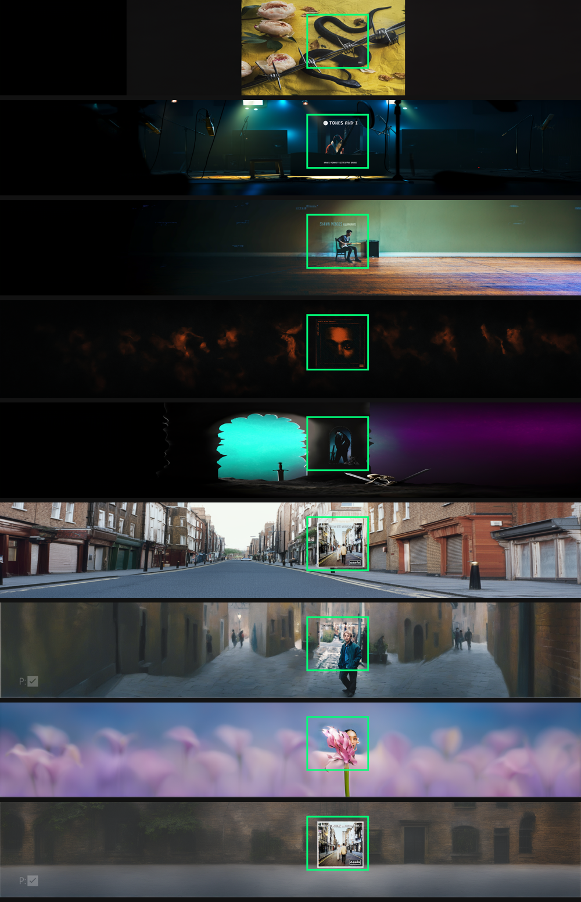
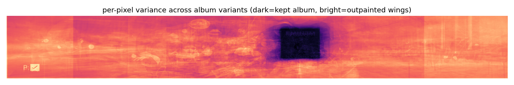
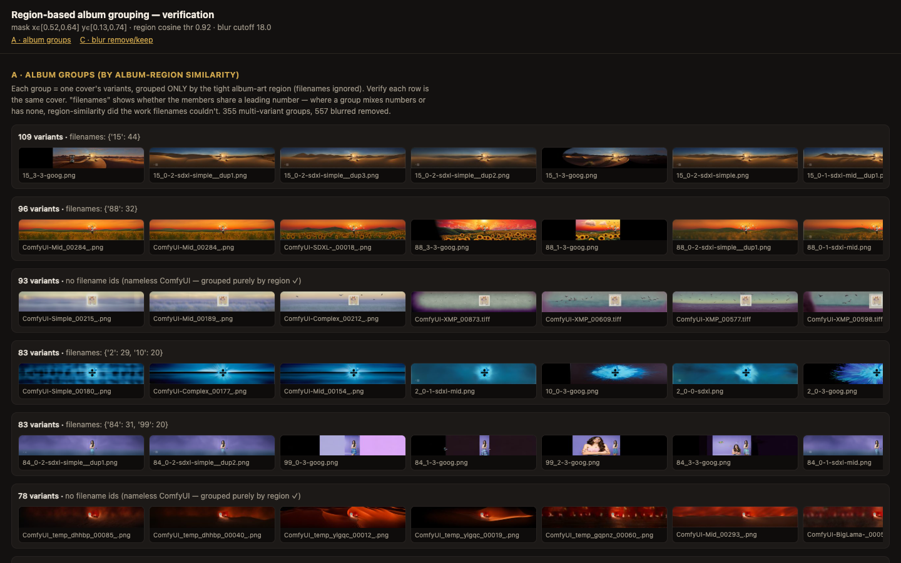
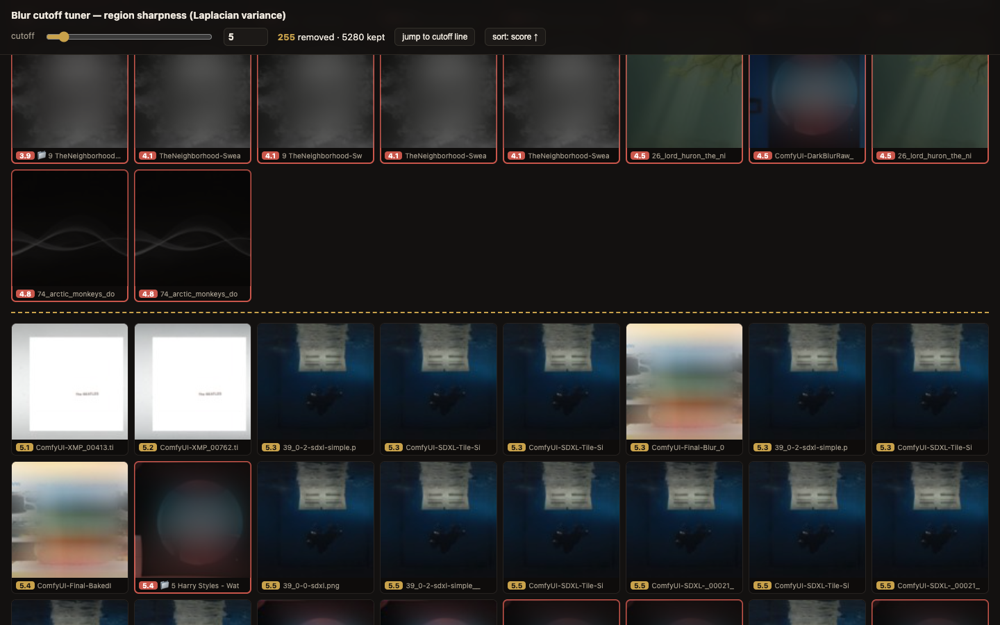

# Ephemeral design interfaces — tuning by visual confirmation

*A working note / portfolio example. Captures a pattern used while building the
outpaintings instance of Muser: for decisions a metric can't settle on its own, I
stand up a **throwaway browser interface** that lets me confirm or tune the decision
by eye, then throw it away. The only thing that persists is the chosen value — not
the UI.*

## The idea

Most of the pipeline is deterministic. But a few steps hinge on a judgment that isn't
computable up front:

- *Where* is the album art inside a 6:1 outpainting?
- Are these two frames the *same* cover, or just similar?
- What blur score is the line between "keep" and "throw away"?

The wrong move is to guess a number, or to trust a single metric and ship. A metric is
a proxy; it's confidently wrong in ways you only see when you *look*. The right move is
to make the judgment **visible and interactive for a few minutes**, decide, and move on.

So I build a small, single-purpose web page — sortable, sliderable, served from a
scratch directory — look at the real artifacts, make the call, and tear it down. The
interface is disposable by design. Its entire job is to move one decision from "guessed"
to "seen."

Four of them from this project, in the order the problem unfolded:

## 1 · Derive a mask by looking, not by assuming

The album art sits at a *fixed* spot in every outpainting — but not where I first
assumed (dead center). It's offset right, because the outpaint pad is asymmetric
(`left=3000, right=2000`). Rather than trust a guess, I overlaid a candidate box on a
spread of real frames and looked at where it landed across every cover style:

The box either lands on the art or it doesn't — you can see it in one glance across
snakes-cover, framed-inset covers (Tones & I, The Weeknd), and a tiny corner panel
(Oasis). A coordinate guess would have silently missed the off-center ones.

To find the *exact* box, I averaged per-pixel variance across many variants of the same
cover: the album pixels stay identical (low variance = dark), the outpainted wings
differ (high variance = bright). The kept region falls out as a shape you can read
directly:

The mask isn't asserted — it's *shown*, and it agrees with the generator's own pad math.

## 2 · Verify the grouping before trusting it

The dedup groups covers by the similarity of that masked region. Before wiring it into
the product, I rendered the groups as a page so I could confirm each stack is really one
cover — and catch the failure modes (look-alike over-merges, blurred regions chaining
together):

Reading it, the payoff is obvious at a glance: one stack has 109 variants where only 44
carried the cover's name in the filename — region similarity found 65 the filenames
missed — and another 93-variant stack has *no* filename ids at all, grouped purely by
the art. That's not a number in a log; it's a wall of covers you can see are the same.

## 3 · Tune a threshold live, don't snapshot it

The hero of the set. Choosing the blur cutoff is a judgment: the region-sharpness metric
conflates *blurred* with *simple-but-sharp*, so no single computed value is right — you
have to see where the covers actually stop looking blurry. A static "remove vs keep"
image freezes one cutoff and can't answer "is it right?". So instead:

*Captured at the threshold line itself — the defining state of the interface: blurry
covers removed (red, scores 3.9–4.8) above the dashed boundary, sharp covers kept
(Beatles 5.1, framed panels 5.3–5.5) below it. You can read straight off the image that
a cutoff of 5 lands in the right place.*

- Every cover sorted worst-first, so the decision boundary is a place you scroll to.
- Each tile is the **region crop the metric actually scores** — what you see is what it sees.
- A live slider + number box; dragging updates the keep/remove count and red-outlines
  everything past the cutoff, with a "jump to cutoff line" button to land right on the
  fence.
- A second, independent signal OR'd in — a 📁 tag for frames I'd hand-sorted into
  `blurred/` folders, removed regardless of score — so human labels and the cheap metric
  reinforce each other.

You sweep 5 / 10 / 18 in seconds, watch the boundary move through real covers, read the
score where quality breaks, and that number goes into the pipeline. Then the page is
gone.

## The principles

What makes these *ephemeral design interfaces* rather than app features:

- **Ephemeral.** Served from a scratch dir (`/tmp/...`), never committed, torn down after
  the decision. The only durable output is the chosen value. No maintenance, no clutter.
- **Visual.** Show the exact artifact the algorithm judges — the masked crop, not the
  whole frame. Hiding it is how metrics lie.
- **Interactive over static.** A snapshot answers one question; a slider lets you sweep.
  The value is watching the boundary move, which a PNG can't give you.
- **Human-confirmed.** The person reads where quality breaks — a judgment, not an
  `argmin`. The interface's whole purpose is to make that judgment fast and honest.
- **Disposable, so cheap.** Because nothing has to be maintained, the bar to building one
  is minutes. That low cost is what makes "just look at it" the default instead of
  "trust the number."

The throughline: **keep the human in the loop for the decisions that aren't computable,
and spend nothing keeping the tool around afterward.**

---

*Built with Muser's own thumbnail/serve plumbing; the tuner reuses region crops already
produced by the embedding step, served straight off disk. Related project docs:
`docs/experiments/` (empirical evals), `REQUIREMENTS.md` (scope).*
