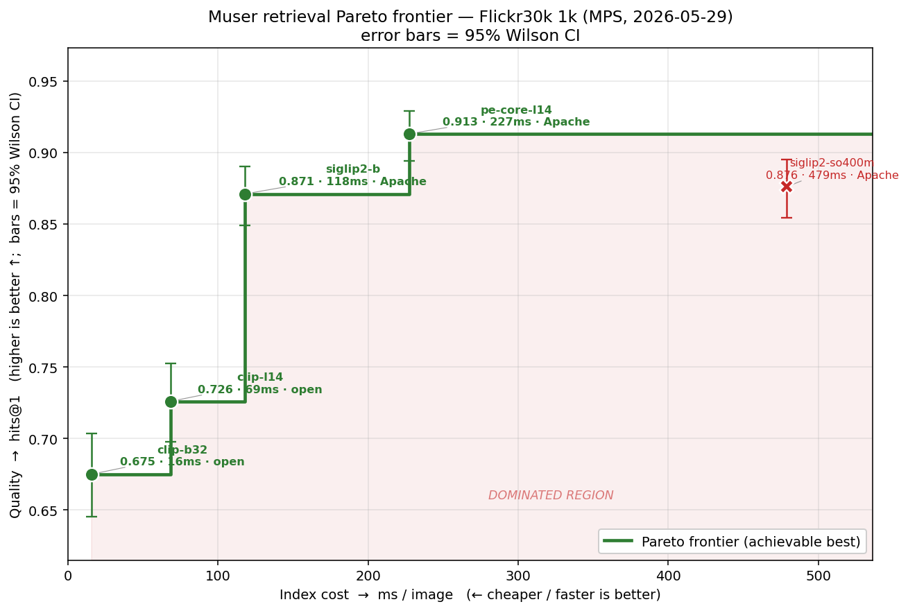
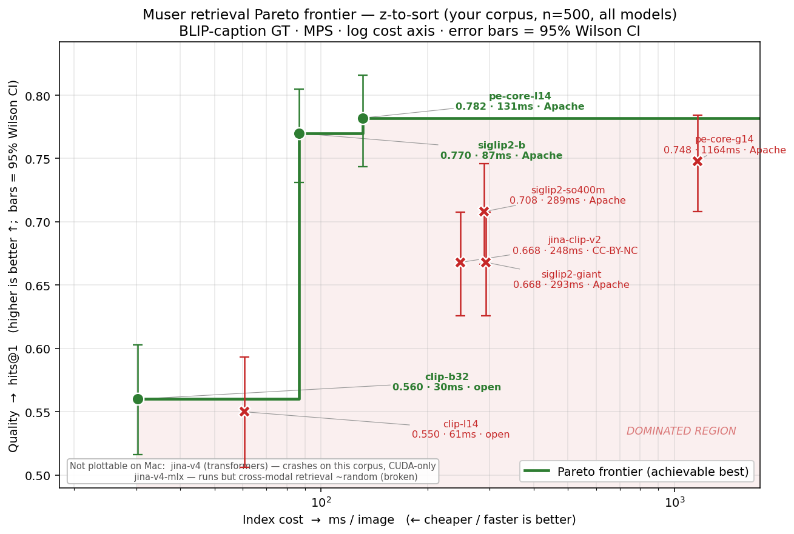

# Muser model benchmark — 2026-05-29

Empirical comparison of image→text retrieval embedding models for Muser, run this
session on Apple Silicon (MPS, 64 GB). Goal: pick the best quality-per-cost model,
commercial-license-aware.

## Pareto frontier

Frontier computed in code (a point is dominated if another is cheaper-or-equal in
ms/img **and** higher-or-equal in hits@1):

- **On frontier:** `clip-b32` → `clip-l14` → `siglip2-b` → `pe-core-l14`
- **Dominated:** `siglip2-so400m` (pe-core-l14 is both cheaper *and* higher quality)

## Results — Flickr30k full 1k test set (authoritative)

Same eval for all five (1000 images, 1000 caption queries, `ranx` metrics).
`ms/img = index_s / 1000` (includes one-time model load; minor at n=1000).

| model | hits@1 | recall@5 | recall@10 | ndcg@10 | ms/img | license | frontier |
|---|---|---|---|---|---|---|---|
| **pe-core-l14** | **0.913** | 0.988 | 0.997 | **0.959** | 227 | Apache-2.0 | ✓ best quality |
| siglip2-so400m | 0.876 | 0.980 | 0.989 | 0.939 | 479 | Apache-2.0 | ✗ dominated |
| **siglip2-b** | 0.871 | 0.967 | 0.979 | 0.930 | 118 | Apache-2.0 | ✓ best value |
| clip-l14 | 0.726 | 0.920 | 0.963 | 0.847 | 69 | open (OpenAI) | ✓ |
| clip-b32 | 0.675 | 0.897 | 0.938 | 0.811 | 16 | open (OpenAI) | ✓ speed floor |

## Domain eval — `z-to-sort` (the user's real corpus)

Flickr is general photos; the real corpus is creative/AI-gen/screenshot imagery.
Ground truth auto-generated: each of 500 sampled images captioned with BLIP-large;
the caption is the query, its source image the correct answer (`eval/domain.py`).
Absolute scores are lower than Flickr (BLIP captions on a near-duplicate-heavy dump
are less discriminative) but difficulty is identical across models, so the ranking
holds. Error bars = 95% Wilson CI.

All eight Mac-runnable models on the *same* n=500 eval (so they're comparable):

| model | hits@1 | ndcg@10 | ms/img | license | frontier |
|---|---|---|---|---|---|
| pe-core-l14 | 0.782 | 0.881 | 131 | Apache | ✓ |
| **siglip2-b** | 0.770 | 0.877 | 87 | Apache | ✓ best value |
| pe-core-g14 (2B) | 0.748 | — | 1164 | Apache | ✗ dominated |
| siglip2-so400m | 0.708 | 0.819 | 289 | Apache | ✗ dominated |
| jina-clip-v2 | 0.668 | — | 248 | CC-BY-NC | ✗ dominated |
| siglip2-giant (1.9B) | 0.668 | — | 293 | Apache | ✗ dominated |
| clip-b32 | 0.560 | 0.714 | 30 | open | ✓ floor |
| clip-l14 | 0.550 | 0.694 | 61 | open | ✗ dominated |

The **giants confirm the rule that bigger ≠ better for retrieval**: pe-core-g14 (0.748)
loses to its own L sibling (0.782) at 9× the cost; siglip2-giant (0.668) is far below
siglip2-b. jina-clip-v2 (0.668) is dominated *and* non-commercial. (jina-v4 transformers
crashes on this messy corpus / is CUDA-only; jina-v4-mlx runs but its cross-modal
retrieval is ~random — neither gets a domain point.)

**What domain eval changed vs. Flickr (why it was worth running):**
- **pe-core-l14 ≈ siglip2-b — a statistical tie** here (0.782 vs 0.770, < 1 SE at
  n=500; CIs overlap heavily). PE's real Flickr lead **disappears on this corpus** →
  siglip2-b (tied, faster, clean install) is the clear pick for *this* data.
- **siglip2-so400m falls clearly below siglip2-b** (0.708 vs 0.770, ~3 SE) — on
  Flickr they tied; here so400m is worse *and* 3× slower. Doubly dominated.
- **clip-l14 ≤ clip-b32** (0.550 vs 0.560) — the Flickr ordering reverses; clip-l14
  drops *off* the frontier. clip-b32 is the only CLIP worth keeping (speed floor).
- The SigLIP/PE tier beats the CLIP tier by **~22 pts** (vs ~15 on Flickr) — model
  choice matters *more* on the real creative/screenshot mix.

**Domain frontier:** `clip-b32` → `siglip2-b` → `pe-core-l14`. Verdict for the user's
data: **siglip2-b is the default** (tied-best quality, fastest top-tier, Apache, clean
install); pe-core-l14's edge isn't worth its install friction here.

## Other models tested today (not on the 1k axis)

Smaller/earlier evals or disqualified — shown for completeness.

| model | hits@1 | eval | verdict |
|---|---|---|---|
| jina-v4 (transformers) | 0.967 | n=60 | best raw quality, but **crashes on Mac MPS** — CUDA server only |
| pe-core-g14 (2B) | 0.967 | n=150 | **not better than L14**, ~18× slower — skip |
| siglip2-giant (1.9B) | 0.947 | n=150 | *below* so400m on retrieval, slow — skip (giants don't help retrieval) |
| jina-clip-v2 | 0.855 | n=200 | ≈ clip-l14 (English); multilingual edge; **CC-BY-NC**, ~10× slower |
| jina-v4-mlx | broken | — | MLX runs stably on Mac but cross-modal retrieval is ~random |
| siglip2 (pre-fix) | 0.230 / 0.085 | n=200 | mis-integrated; **fixed** via SigLIP's fixed 64-token text padding → 0.945+ |
| OpenVision 2 | n/a | — | **no text encoder** (generative-only) — cannot do text→image retrieval |

## Recommendations

| Need | Pick | Why |
|---|---|---|
| **Default** | `siglip2-b` | frontier, 0.871 @ 118 ms, Apache, clean install |
| **Max quality (commercial-safe)** | `pe-core-l14` | 0.913, Apache, ~2× faster than so400m; install wrinkle (`perception_models` `--no-deps` for decord) |
| **Speed floor** | `clip-b32` | 16 ms/img, 0.675 |
| **Drop** | `siglip2-so400m`, both giants, jina-clip-v2 | dominated / no retrieval gain / license |
| **Frontier quality, at scale** | `jina-v4` on a CUDA box | 0.967, but server-only (see PERFORMANCE.md for H100 cost/time) |

## Methodology & caveats

- **Eval:** Flickr30k test split via HF `refs/convert/parquet`; 1 caption/image as the
  query; metrics via `ranx` (hits@1, recall@5/10, MRR, nDCG@10, MAP).
- **Hardware:** Apple Silicon MPS, single stream, batch 16. H100 (batched) is ~50–300×
  faster per image — see `docs/PERFORMANCE.md`.
- **ms/img includes one-time model load** (negligible at n=1000; inflates small runs).
- **Saturation:** at n=150 the top models tied (~0.97, recall@5/10 ≈ 1.0). n=1000
  broke the tie — that's why this report uses the 1k numbers.
- **Domain check:** Flickr is general photos. The user's real corpus (`z-to-sort`) was
  validated qualitatively via per-query contact sheets (clip-l14, siglip2-b), consistent
  with these rankings.
- **License note:** jina-clip-v2 and MetaCLIP-2 are CC-BY-NC; DFN5B/AIMv2 are
  `apple-amlr` (research-leaning). Apache-safe leaders: pe-core-l14, siglip2-b/so400m.
